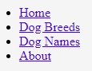
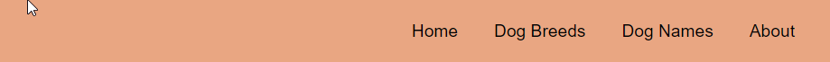

# Web Styling

Before we start on our own page, we should get familliar with some css selectors, and some flexible box layouts. You can do so by playing the two games below. Spend about 10 - 15 mins on each of them.

Css Diner - [https://flukeout.github.io/](https://flukeout.github.io/)

Flexbox froggy - [https://flexboxfroggy.com/](https://flexboxfroggy.com/)

## Navigation bar

We will start by making the `navigation bar`. This is part of website navigation which is to help users navigate their way through a website. These are usually a grouped set of clickable links that take you to various pages within the website.

A very common way that navigation is structured in HTML markup is that links are set inside `<li> list items` in an `<ul> unordered list`.

```html
<ul> <!-- the unordered list container -->
  <li>Home</li> <!-- a list item -->
  <li>Dog Breeds</li>
  <li>Dog Names</li>
  <li>About</li>
</ul>
```

To make the links clickable, each of the `<li> list items` have `<a> anchor element` used to create hyperlinks. The anchor elements have a hyperlink that will *navigate* you to another part of the website when clicked. The example below has placeholder anchor links `#` that will just go nowhere when you click them. In a real website, these would contain actual links to other pages in your website.

```html
<ul>
  <li><a href="#">Home</a></li>
  <li><a href="#">Dog Breeds</a></li>
  <li><a href="#">Dog Names</a></li>
  <li><a href="#">About</a></li>
</ul>
```



You will see this structure in the `index.html` file that's been given to you. This unordered list is inside of a `<nav> navigation` element.
This has curently no styles applied to it, so we will add some styles to enhance the visual layout and the user experience.

After we finish styling the navigation, we will end up with something that looks like this:


### Lets start applying navigation styles

#### 1. Open Files for Editing

Find your `index.html` file and open it in **Chrome** or **Edge**.

Open the folder that contains your `index.html` and `style.css` files in **VS code**.

You will find that the `style.css` file already has a `background-color` style applied to the html. Otherwise, there is no other styles inside this file. We will have to add the rest.


#### 2. Flexible Box Layout

There are **MANY** ways that we could style this, but in this example we will use `flex` (flexible box layout) to align the list items in the navigation bar.

#### a. CSS selector
  
  Before we can apply any type of styling, we need to use a css selector to target the `<ul>` apply the flexible box layout.

  Note: For this example we want to select only the `<ul>` element's that are a direct child of `<nav>` elements.

  This will look something like this:

  ```css
  nav > ul {
    /* css styles go in here */
  }
  ```

  ```html
  <body>
    <header>
      <nav> <!-- (parent) -->
        <ul> <!-- (child) CSS Selector will select this -->
          <li><a href="#">Home</a></li>
          <li><a href="#">Dog Breeds</a></li>
          <li><a href="#">Dog Names</a></li>
          <li><a href="#">About</a></li>
        </ul>
      </nav>
    </header>
    ...
  ```
  
#### b. Make it display flex
  
  Now that we have the right unordered list element selected, it's time to add the CSS styles to it. First up let's make it Flex.

  ```css
  nav > ul {
    display: flex;
  }
  ```

  

  We can use the `justify-content` to move the element inside the ul to the end of the page. We can use `flex-end` to achieve this.

  ```css
  nav > ul {
    display: flex;
    justify-content: flex-end;
  }
  ```

  

#### c. Remove the bullet points

  The standard way unordered lists are displayed in a web browser is with bullet points. So we need to use styling if we want to remove them. We need to add the `list-style-type` and set it to `none`.
 
  ```css
  nav > ul {
    display: flex;
    justify-content: flex-end;
    list-style-type: none;
  }
  ```

  
  
#### d. Spacing the list items

  Curently the list items are all jammed up close together. We should add some spacing so it adds a better user experience.

  To do this we need to use the css selector to select the list items that are children to the `nav > ul`.

  From the image below, you can see the order of the spacing around an element. The element itself is the blue box in the middle. The `padding` is the spacing inside the border. Then you have the `border`. Then outside the border the spacing is called `margin`.

  

  Once we have the list items `<li>`'s selected, we can apply a margin spacing to it. In this example, we will use a `margin-right` of `40px`. Margin-right, means that it will only apply margin spacing to the right hand side of the element and 40px means 40 pixels.

  ```css
  nav > ul > li {
    margin-right: 40px;
  }
  ```

  

#### e. Changing link styles

  Currently the links are a small serif font, which is underlined and blue. We want to change this to something more appealing.

  Like always, we need to first use a **css selector** to select what we want to change. In this case we want to change the `<a>` elements inside the list items we've already selected. This is just as easy to append a direct child selector for `a` to our last selector for the `nav > ul > li`.

  ```css
  nav > ul > li > a {

  }
  ```

Here we want to :

- Change the **font** to Arial by using `font-family: Arial`
- Remove the link **underlines** by using `text-decoration: none`
- Change the **text color** to black by using `color: black`
- Make the **font size** a bit larger by using `font-size: larger`.

```css
nav > ul > li > a {
  font-family: Arial;
  text-decoration: none;
  color: black;
  font-size: larger;
}
```


If you want to learn more about font sizing visit: [https://www.sitepoint.com/css-font-sizing-tutorial](https://www.sitepoint.com/css-font-sizing-tutorial/)

#### f. Adding color to the navivation header

At the moment the navigation header has no color to it. In this example we want to make the header a solid color. You can choose whatever color you want.

But first, again we need to identify what we want to select. Looking at the HTML markup in index.html, we can see that the `<nav>` navigation element sits inside of the `<header>` element. It looks like it will make sense to apply the `background-color` to the whole header. So we will start off the css by selecting the `<header>` and applying a `background-color: #F5A281`. *Note: VScode has a color picker that you can use to pick a color that you like*

```css
header {
  background-color: #F5A281;
}
```


Looking good! However, in this example, we want to have the background color in the header bar to be much thicker. We can do this by adding a `height` to it. We will add `height: 70px` remember px is pixels.

```css
header {
  background-color: #F5A281;
  height: 70px;
}
```


The header still doesn't look finished. The text needs to be vertically centered. Can you think of a way to do this?

We can use the `flex` flexible box layout again.

What we need to do is select the header elememt to `display` flex, set the `flex-direction` to column then `justify-content` to the center. Your css should end up looking something like this:

```css
header {
  display: flex;
  flex-direction: column;
  justify-content: center;
  background-color: #F5A281;
  height: 70px;
}
```


Almost there now.

You can see that the header color doesn't go all the way to the edge of the page. This is because, the **body has a default margin of 8px**. All we need to do to remove this is to select the `body` and set it's `margin` to `0px`. That will remove all spacing around the edges.

```css
body {
  margin: 0px;
}
```



Great Work!! Now you can try the navigation extras.

#### g. Navigation header extras

There are a couple of extras we can add to this.

#### I. When the mouse `hover`'s over the link, we can make it underlined

The `:hover` selector is used to select elements when you mouse over them. It can be used on **all** elements, not just only links.

```css
nav > ul > li > a:hover {
  text-decoration: underline;
}
```


#### II. We can pull just the `Home` link to left side of the page

The other thing we might want to do is position the `Home` link on the left side of the screen. This is sometimes where you will see a webpage logo situated.

For this we need a way to select only the first element in the `ul` unordered list.  Luckily css has an easy way to do this. This is to use the `:first-child` selector.

```css
nav > ul > li:first-child {

}
```

Now that we have used the `first-child` selector to select `Home`, we need move it to the left side of the navigation header. What we can do here is to use the margin, and fill it on the right side of the Home link element. With enough margin it can push the home link to the left side of the page.

How much `margin` to use? If we gues a fixed margin, that will mean each time we resize the browser, the fixed amount might be too much or too little and wont keep the `Home` link stuck to the laft side. We will use the `auto` to make sure the `margin-right` is always the right size for the page.

```css
nav > ul > li:first-child {
  margin-right: auto;
}
```


## Cards

Now that you have the Navigation menu completed, it's time to start on the cards that the dogs will be displayed in.

Your page should curently look something like this.


And by the time you finish, it should look something similar to this.


### Tips to complete the cards

#### a. Show the images

You will need to add the image source to the markup for each dog.

 ```html
<article>
  
  <h2>Australian Kelpie</h2>
  <p>The Australian Kelpie, or simply Kelpie, is an Australian ...
</article>
```

#### b. Make the cards

You need to make the cards. To do this you will need to use css to select the `article`'s. Then in there you may need to apply

- padding
- margin
- width (you can also use % instead of px to make the aticle relative size to the screen, up to you)
- background color (make it different to the background color of the `html` element)

You will need to find a way to make the images fit inside the cards. You can use this.

```css
img {
  display: block;
  width: 100%;
  height: auto;
}
```

#### c. Make the cards flex flow row wrap

You will need to find a way to make the cards display in a usable way accross the screen. You should use `flex` for this. You will need to apply flex to the `section`. If you need a reminder, go back to *Flexbox Froggy*.

#### d. Fix up the fonts in the cards

You can make the font sizing more readable, make the card title larger, or change the font's that are used all together. See what you can come up with.

#### e. Add effects to the cards

You can use the `:hover` like we did on the unordered list to make some hover effects on the cards when hovered over. Some things you can try.

- box shaddow [https://www.w3schools.com/cssref/css3_pr_box-shadow.asp](https://www.w3schools.com/cssref/css3_pr_box-shadow.asp)

- transitions [https://www.w3schools.com/css/css3_transitions.asp](https://www.w3schools.com/css/css3_transitions.asp)

## Dog Names

If you have finished all of that. Then you can continue on the page. See what you can come up with for the next sections in the markup. You will need to add the names. You could do something similar to what we did with the cards. Then after that the about section.
